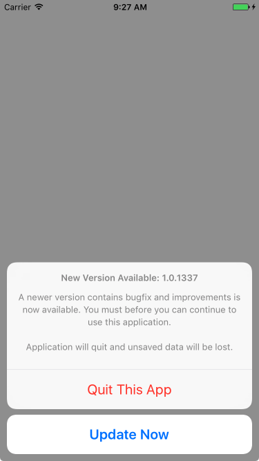

# iOS Ad-Hoc Update

**iOS Ad-Hoc Update** is a simple class for developers to build an auto updating feature for their non-App-Store-released iOS app, including ad-hoc and in-house distributions.



## Features

- Check against local version and a remote, Xcode-generated ad-hoc installation manifest file.
- Forced update option with minimum version settings.
- Promote update dialog and force quit the app before install new `.ipa` file over-the-air.
- Fully localizable UI.

## Usage

As simple as `[UIAdHocUpdate checkForUpdate:manifestURL]`. You can also use compile flag `IS_APP_STORE` to omit the checking in your App Store scheme.

Please see the example project.

## Note

The self-exit feature utilizes the `kill()` syscall, which will be considered as a crash. Thus, it will not quit properly when you use it while debugging on a physical iOS device with Xcode, as it will assert at that point. It works within the Simulator, however.

### License

```
  The MIT License (MIT)

  Copyright © 2017 Zhi-Wei Cai. All rights reserved.

  Permission is hereby granted, free of charge, to any person obtaining a copy
  of this software and associated documentation files (the "Software"), to deal
  in the Software without restriction, including without limitation the rights
  to use, copy, modify, merge, publish, distribute, sublicense, and/or sell
  copies of the Software, and to permit persons to whom the Software is
  furnished to do so, subject to the following conditions:

  The above copyright notice and this permission notice shall be included in all
  copies or substantial portions of the Software.

  THE SOFTWARE IS PROVIDED "AS IS", WITHOUT WARRANTY OF ANY KIND, EXPRESS OR
  IMPLIED, INCLUDING BUT NOT LIMITED TO THE WARRANTIES OF MERCHANTABILITY,
  FITNESS FOR A PARTICULAR PURPOSE AND NONINFRINGEMENT. IN NO EVENT SHALL THE
  AUTHORS OR COPYRIGHT HOLDERS BE LIABLE FOR ANY CLAIM, DAMAGES OR OTHER
  LIABILITY, WHETHER IN AN ACTION OF CONTRACT, TORT OR OTHERWISE, ARISING FROM,
  OUT OF OR IN CONNECTION WITH THE SOFTWARE OR THE USE OR OTHER DEALINGS IN THE
  SOFTWARE.
```
